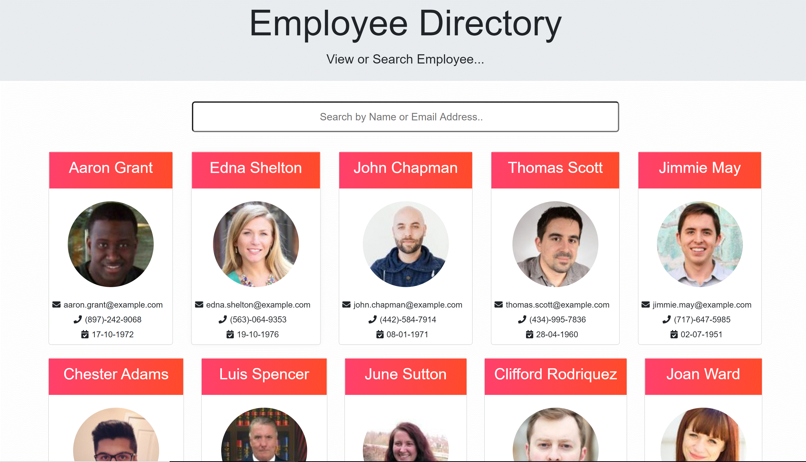
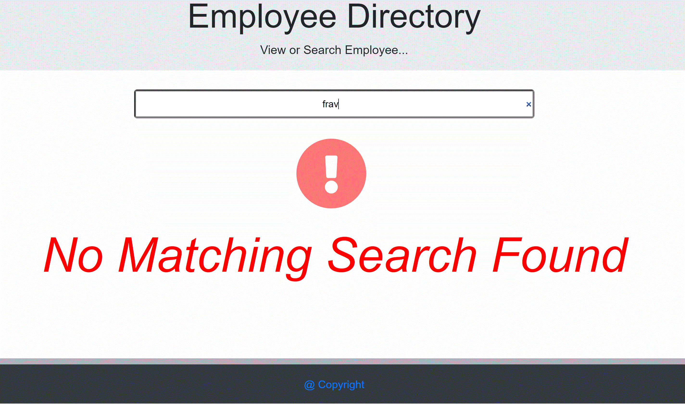
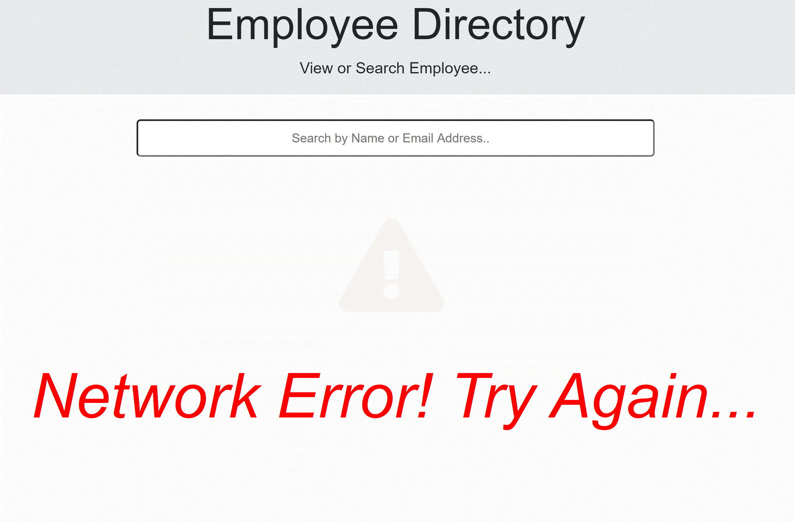

  # PWA: React Employee Directory  
  
   
  
  ## Table of Contents
  
  - [Description](#description)
  - [Installation](#installation)
  - [Usage](#usage)
  - [License](#license)
  - [Contribution](#contribution)
  - [Test](#test)
  - [Authors](#authors)
  - [Questions](#questions)
  
   
  
  ## Description  
  
  This project is a react employee directory. It fetches employee records from an API and presents them in a pleasantly formated front end. It als enables the user to search out an employee based on their first name, last name or email address. MSome efforts is made to chunk the project files into multiple modules for maintainability, context is employed to "broadcast" props across multiple dependent components. A few of the technologies employed included - HTML, CSS, React, axios fetch, react context among others.
  

## Business Context

An employee or manager would benefit greatly from being able to view non-sensitive data about other employees. It would be particularly helpful to be able to filter employees by name or email address.
  
  ## Installation
  
  Connect to the provided project url and start using.
  
  ## Usage
  
Please clone the project to your local repo, install the dependencies, start the app by running npm start. You can also use the hosted application on Heroku. 

 
 
 
 
 
  
  ## License
  
  This project is licensed under:
  
   
  
  MIT
  
  ## Contribution
  
  Please contact me on my email [Email Address](anyaegbufrancis@gmail.com) or fork the repository from my github account: [Github Profile](https://github.com/anyaegbufrancis). Please make a pull request and we can review the updates, corrections or bug fixes together.
  
  ## Test
  
  Please click the below to see the feature demo on Heroku: https://offlinebudgetracker.herokuapp.com/
  
  
  
  ## Authors
  
  The author of this project is: 
  
  Francis Anyaegbu. 
  
  To contribute, please refer to [Contributors](#contributors) section.
  
  ## Questions
  
  For questions, concerns, comments or your valued inputs regargind this README.md generator, kindly go to my Github page or contact me on my email address below:
    
  - [Github Profile](https://github.com/anyaegbufrancis)
                    
  - [Email Address](anyaegbufrancis@gmail.com)
